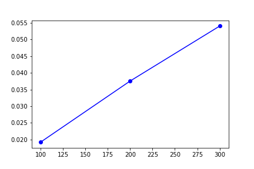

# 🌳 AI-Enhanced Balanced Tree (AEBT) 🌳

Welcome to the **AI-Enhanced Balanced Tree (AEBT)** project! This innovative data structure combines the efficiency of balanced trees with the power of AI, providing enhanced capabilities for data storage, retrieval, sorting, and intelligent analysis.

## Table of Contents

- [Introduction](#introduction)
- [Features](#features)
- [Project Objectives](#project-objectives)
- [Installation](#installation)
- [Usage](#usage)
- [Performance Evaluation](#performance-evaluation)
- [Contributing](#contributing)
- [Acknowledgements](#acknowledgements)

## Introduction

The AI-Enhanced Balanced Tree (AEBT) is designed to efficiently manage data using a balanced tree structure while leveraging AI algorithms for advanced functionalities such as intelligent search and adaptive sorting. By integrating AI, AEBT optimizes data operations, predicts patterns, and provides insightful analysis.

## Features

- **⚖️ Balanced Structure:** Utilizes AVL or Red-Black tree properties for efficient data operations.
- **🧠 AI-Driven Optimization:** Incorporates AI algorithms to optimize search, insertion, deletion, and sorting operations dynamically.
- **🔍 Intelligent Search:** Learns from past search patterns and predicts relevant elements.
- **🔄 Adaptive Sorting:** Employs adaptive sorting algorithms based on data characteristics.
- **📊 Performance Monitoring:** Tracks data access patterns and execution times, using AI to adjust the tree structure for optimal performance.

## Project Objectives

1. Develop an efficient, AI-integrated balanced tree.
2. Enhance sorting and search capabilities using AI.
3. Optimize memory usage while maintaining high performance.
4. Ensure scalability for large datasets.
5. Provide a user-friendly interface.
6. Validate and benchmark performance.
7. Demonstrate real-world use cases.
8. Document and share findings.
9. Encourage further research and development.

## Installation

1. Clone the repository:
    ```sh
    git clone https://github.com/yourusername/AEBT.git
    ```
2. Navigate to the project directory:
    ```sh
    cd AEBT
    ```
3. Install the required dependencies:
    ```sh
    pip install -r requirements.txt
    ```

## Usage

1. Run the script:
    ```sh
    python aebt.py
    ```
2. Follow the menu prompts to perform data operations:
    - Insert data into the balanced tree.
    - Sort data using AI-enhanced sorting.
    - Search for elements using AI predictions.

## Performance Evaluation

The AEBT tracks the time taken for sorting and searching operations. You can visualize the performance data using the plotting menu:

1. Choose an option to plot sorting, searching, or both data.
2. View the plotted graphs showing the time complexity for different dataset sizes.

### Example Plots

- **Sorting Data:**
    

- **Searching Data:**
    

## Contributing

Contributions are welcome! Please fork the repository and submit a pull request. For major changes, please open an issue to discuss what you would like to change.

1. Fork the Project.
2. Create your Feature Branch (`git checkout -b feature/AmazingFeature`).
3. Commit your Changes (`git commit -m 'Add some AmazingFeature'`).
4. Push to the Branch (`git push origin feature/AmazingFeature`).
5. Open a Pull Request.


## Acknowledgements

- Developed by **Swayam**.
- Inspired by the need for efficient and intelligent data management solutions.
- Special thanks to the contributors.

## Contributors

- Swayam Khandelwal ([@Swayamkh02](https://github.com/Swayamkh02))
- Vijaykumar Mamadapur ([@contributor1](https://github.com/contributor1))
- Roopa L S ([@Roopa4112](https://github.com/Roopa4112))

---

> **Tags:** `AI`, `Balanced Tree`, `Data Structure`, `Machine Learning`, `Python`

> **Emojis:** 🌳⚖️🧠🔍🔄📊
